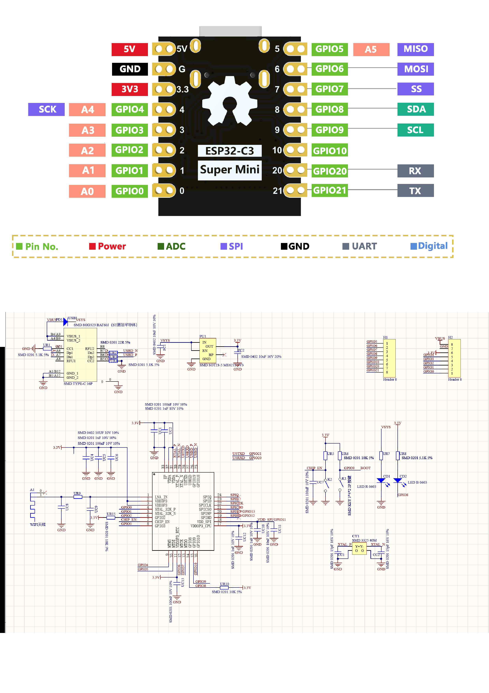
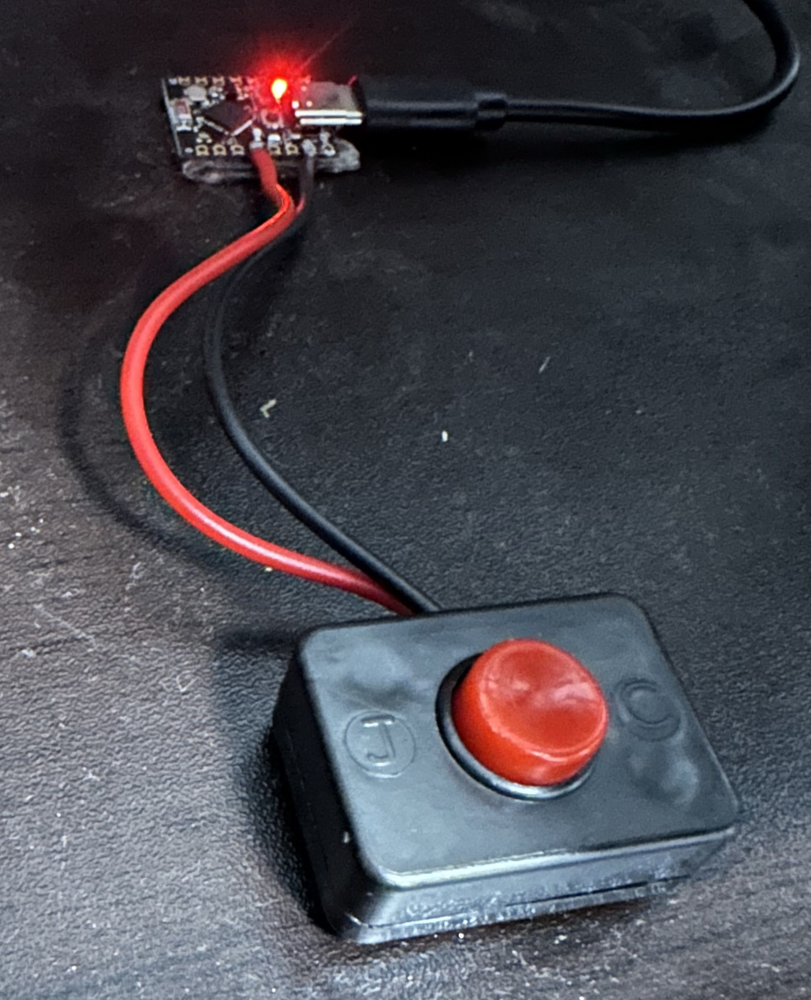

# ESP32 HomeKit 电脑启动器

本项目基于 **ESP32-C3**，实现通过 HomeKit（苹果家庭）控制电脑的远程开关机。支持物理按钮唤醒、长按重置、双击关机、UDP 心跳检测等功能，适用于需要远程唤醒/关闭 Windows 电脑的场景。

---

## ⚡ 硬件连接

- **LED 指示灯**：GPIO8 板载
- **按钮**：GPIO3 外接一个自复位按钮（按键一端接 GPIO3，另一端接 GND）

> 请根据实际开发板调整引脚定义。

---

## 📷 实物图片

  
   
  <em>ESP32-C3 开发板</em>

  
   
  <em>电脑启动器成品实物图</em>

---

## ✨ 功能特性

- 🏠 支持 HomeKit 配网，iPhone/iPad 可直接控制电脑开关
- 🔘 短按按钮：唤醒电脑（发送 WOL 魔术包）
- 🔁 双击按钮：发送关机指令
- ⏳ 长按按钮：重置设备（清除配对和配置信息）长按到蓝色 LED 亮起
- 💻 电脑端心跳检测，自动同步 HomeKit 开关状态
- 🌐 支持网页工具配对 WiFi 和目标电脑 MAC 地址

---

## 🚀 快速开始

### 1. 烧录固件与配对

1. 访问 [配对工具和固件烧录页面](https://machetehot.github.io/c3Homekit/)，输入 WiFi 信息和电脑 MAC 地址，生成二维码，并可直接在线烧录固件到 ESP32-C3。
2. 上电后，使用 iOS 设备扫描二维码，按提示完成 HomeKit 配网。
3. 电脑端需运行 [windows_shutdown 服务端](https://github.com/macheteHot/windows_shutdown)，用于接收关机指令和发送心跳包。

### 2. 按钮操作说明

- **短按**：唤醒电脑（发送 WOL）
- **双击**：发送关机指令
- **长按（蓝色 LED 亮起可松）**：重置设备，清除配对和配置

### 3. HomeKit 控制

- 在“家庭”App 中添加配件，烧写与配对工具页面会自动生成二维码，使用 iOS 设备扫描二维码即可加入 家庭 APP

---

## 🖥️ 电脑端服务端

请参考 [windows_shutdown 仓库](https://github.com/macheteHot/windows_shutdown) 部署 Windows 服务端，实现关机和心跳功能。

---

## 🙏 参考/鸣谢

- [HomeKit-ESP32](https://github.com/espressif/esp-homekit-sdk)
- [windows_shutdown](https://github.com/macheteHot/windows_shutdown)

---

如需更详细的使用说明或遇到问题，欢迎提交 Issue 或 PR！
